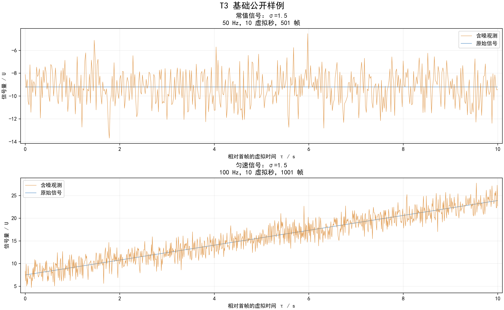
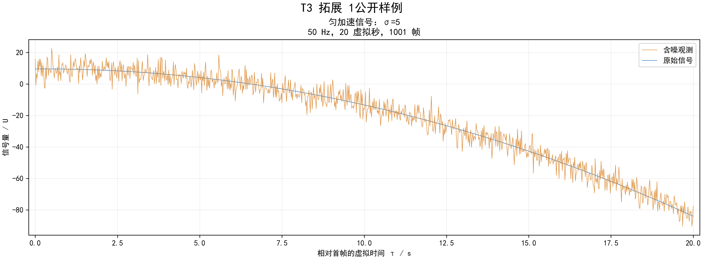
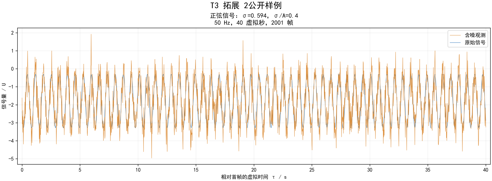
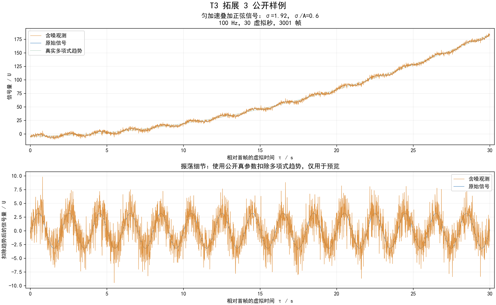

# T3：信号参数估计

## 题目描述

已知一维信号的类型及观测噪声标准差，按时间顺序接收观测数据，估计生成
原始信号的参数。每帧观测为：

$$
y_k=s(\tau_k;\theta)+\varepsilon_k,\qquad
\varepsilon_k\overset{\mathrm{iid}}{\sim}\mathcal N(0,\sigma^2),\qquad
\tau_k=t_k-t_0.
$$

`t0` 是第一帧时间戳。**噪声叠加到完整信号上，每帧只加一次**；各帧噪声独立。
一个测试点内，类型、真实参数和噪声标准差保持固定。真实参数由考生估计。

测评器输入完整序列后读取一次最终估计。可以保存历史观测统一拟合，也可以
递推估计；算法自行选择。T3 独立编译、运行和评分。

提供可编译模板、四组公开样例与预览图。正式测评使用已经冻结的 45 个测试点，
参数范围、误差阈值及资源限制如下。正式测试点、标准参数、测评器和答案只保存在
测评仓库，不随模板发布；模板中的 `examples/` 仅用于开发和自检。

## 信号模型与返回值

返回类型 `ParameterEstimate` 包含六个 `double`，各模式的顺序如下。

| 模式 | 原始信号 | 六项参数数组 |
| --- | --- | --- |
| `Constant` | $c$ | `[c,0,0,0,0,0]` |
| `Linear` | $c+v\tau$ | `[c,v,0,0,0,0]` |
| `Quadratic` | $c+v\tau+\frac12a\tau^2$ | `[c,v,a,0,0,0]` |
| `Sine` | $b+A\sin(2\pi f\tau+\phi)$ | `[b,A,f,phi,0,0]` |
| `QuadraticSine` | $c+v\tau+\frac12a\tau^2+A\sin(2\pi f\tau+\phi)$ | `[c,v,a,A,f,phi]` |

- 所有参数相对于第一帧时刻定义。常值、匀速、匀加速模式中的 `c` 是首帧真实值；
  `v` 是首帧变化率。
- 二次项系数是 `a/2`。例如 `1 + 2*tau + 3*tau*tau` 对应 `c=1,v=2,a=6`。
- 组合信号中的 `c,v,a` 是多项式部分的参数。完整信号的首帧值为
  `c + A*sin(phi)`，首帧变化率为 `v + 2*pi*f*A*cos(phi)`。
- 组合信号只含一个常量项 `c`。
- `A > 0`，`f > 0`，`phi` 按 `[-pi,pi)` 返回。
- 未使用项必须置零；全部六项均必须有限，不能包含 NaN 或 Inf。

若信号量的单位为 `U`，则 `c/b/A` 为 `U`，`v` 为 `U/s`，`a` 为 `U/s²`，
`f` 为 Hz，`phi` 为弧度；这里的秒均指虚拟秒。

### 参数生成范围

生成原始信号时，各模式中的有效参数使用以下范围。

| 参数 | 含义 | 生成范围 |
| --- | --- | --- |
| `c` | 常值信号或多项式部分的常量项 | `[-10,10] U` |
| `b` | 纯正弦信号的偏置 | `[-10,10] U` |
| `v` | 多项式部分在首帧时刻的变化率 | `[-2,2] U/s` |
| `a` | 多项式部分的加速度 | `[-0.5,0.5] U/s²` |
| `A` | 正弦部分的幅值 | `[0.5,5] U` |
| `f` | 正弦部分的频率 | `[0.2,2] Hz` |
| `phi` | 正弦部分在首帧时刻的相位 | `[-pi,pi)` 弧度 |

随机抽样的有效参数在各自区间内独立均匀抽取。测评数据还会固定部分参数，
覆盖区间端点、零值、中等幅值代表及特定参数组合；每个测试点内参数保持不变。

`c`、`b`、`v`、`a` 均允许为零，`A` 和 `f` 始终为正。未使用的数组项按接口
约定置零。表中范围约束的是真实参数，叠加噪声后的观测量可以超出这些范围。
估计结果不要求落在生成区间内，仍按参数误差阈值及返回值合法性判定。

## 虚拟时间与输入约定

时间戳和观测量保证有限，时间戳严格递增。构造对象时只提供模式与有限非负的 `sigma`；
后续输入每帧的 `timestamp` 与 `observation`。不提供真实模型参数。

数据使用保存好的虚拟时间戳，测评按顺序连续调用接口，不逐帧等待墙钟时间。
例如把 30 秒的观测加速回放，只会缩短实际投喂耗时，参数仍按 30 个虚拟秒计算。

例如首帧时间为 `100`，信号为 `3 + 2*(t-100)`，即使末帧时间为 `110`，
也应返回 `[3,2,0,0,0,0]`。

每个测试点只创建一个对象，依次输入完整非空序列，然后调用一次 `estimate()`。
当前规则不在中途检查估计或收敛过程。

## 固定接口

接口位于 [include/signal_identifier.hpp](include/signal_identifier.hpp)。

```cpp
enum class SignalMode : std::uint8_t {
    Constant, Linear, Quadratic, Sine, QuadraticSine,
};

struct ParameterEstimate {
    std::array<double, 6> parameters{};
};

class SignalIdentifier {
public:
    SignalIdentifier(SignalMode mode, double noise_stddev);
    ~SignalIdentifier();
    void update(double timestamp, double observation);
    [[nodiscard]] ParameterEstimate estimate() const;
};
```

调用流程：

```cpp
SignalIdentifier identifier(mode, sigma);
for (const auto& sample : samples) {
    identifier.update(sample.timestamp, sample.observation);
}
const ParameterEstimate result = identifier.estimate();
```

保持类名、公开函数签名、参数顺序及官方头文件中的对象布局不变。
算法状态和历史数据放在 `src/signal_identifier.cpp` 的 `Impl` 内，可增加辅助
`.cpp` 或头文件。正式测评按既有约定使用官方头文件并编译本题 `src/` 下全部
`.cpp`；考生的 `main.cpp` 和 `CMakeLists.txt` 不参与正式测评。

## 测试点与计分

| 部分 | 内容 | 测试点数 | 计分方式 |
| --- | --- | ---: | --- |
| 基础 | 常值 10 点、匀速 10 点 | 20 | 全部通过后才运行拓展 |
| 拓展 1 | 匀加速 | 10 | 每点 1 分，共 10 分 |
| 拓展 2 | 正弦，偏置、幅值、频率和相位均未知 | 10 | 每点 2 分，共 20 分 |
| 拓展 3 | 匀加速叠加正弦，六个参数均未知 | 5 | 每点 4 分，共 20 分 |

合计 **45 点，拓展最高 50 分**。基础未达到 `20/20` 时，拓展标记 `SKIPPED`，
不运行、不计分。基础全部通过后，三个拓展独立测评；单点失败后继续其他点。
所有部分使用同一次编译结果。

每个测试点全部有效参数都达标才通过，不按正确参数数量拆分给分。
若各拓展分别通过 `n1,n2,n3` 点，拓展得分为 `n1 + 2*n2 + 4*n3`。

## 参数误差判定

先检查返回值合法性，再将有效参数与生成信号时的真实参数比较。
对非相位参数，采用：

$$
|\hat\theta_j-\theta_j|\le T_j,\qquad T_j=k\,s_j+\eta_j.
$$

相位使用圆周误差：

$$
\left|\operatorname{atan2}\bigl(\sin(\hat\phi-\phi),
\cos(\hat\phi-\phi)\bigr)\right|\le T_\phi.
$$

`s_j` 是按该点的噪声、采样时刻与模型计算的参数估计标准差尺度：

- 常值、匀速、匀加速：最小二乘协方差
  $C=\sigma^2(X^\mathsf TX)^{-1}$，`s_j = sqrt(C[j,j])`。
  `X` 的每行分别为 `[1]`、`[1,tau]`、`[1,tau,0.5*tau*tau]`。
- 正弦、组合：真实参数处的完整雅可比
  $J_{kj}=\partial s(\tau_k;\theta)/\partial\theta_j$，使用局部尺度
  $C_{\mathrm{loc}}=\sigma^2(J^\mathsf TJ)^{-1}$，
  `s_j = sqrt(C_loc[j,j])`。这是非线性局部近似，已通过独立噪声重复实验校准。

完整矩阵计入参数相关性。各点尺度由测评器预计算并保存，阈值不依赖考生输出。
不同算法可以返回不同但达标的估计结果。

**正式测评使用 `k=4`，有效参数的 `eta_j=1e-8`（各参数自身单位）**。
公开样例的 `truth.json` 保存示例参数、尺度和逐项阈值，采用相同公式；
正式测试点另行冻结。样例中的历史生成状态字段不参与正式判分。

例如某匀速点真值为 `c=3,v=2`，允许误差为 `0.08,0.04`，则
`[3.04,1.97,0,0,0,0]` 通过，`[3.04,1.90,0,0,0,0]` 因 `v` 超限失败。
这两个阈值仅用于解释规则。

## 噪声范围与资源限制

正式数据采用以下噪声上限和采样配置。

| 噪声参数 | 上限 |
| --- | --- |
| 基础 `sigma` | `sigma <= 3 U` |
| 拓展 1 `sigma` | `sigma <= 10 U` |
| 拓展 2 噪声 | `sigma/A <= 0.8` |
| 拓展 3 噪声 | `sigma/A <= 1.2` |

| 部分 | 观测频率 | 虚拟时长 | 最大帧数 |
| --- | --- | --- | ---: |
| 基础 | 50/100 Hz | 10 s | 1001 |
| 拓展 1 | 20/50/100 Hz | 10/20 s | 2001 |
| 拓展 2 | 50 Hz | 40 s | 2001 |
| 拓展 3 | 100 Hz | 30 s | 3001 |


多项式模式的噪声还按最终原始信号的整体尺度控制：

$$
\sigma \le 0.8\operatorname{RMS}(s)
=0.8\sqrt{\frac1N\sum_{k=0}^{N-1}s(\tau_k;\theta)^2}.
$$

该规则对常值、匀速和匀加速模式采用硬上限，达到上限时直接取上限，避免把噪声
按随机上限比例再次压小。正弦和组合模式保持题目给出的 `sigma/A` 原值，不因
RMS 规则降低比例；生成参数会先保证完整信号的 RMS 足够大。所有模式的噪声仍然
独立、零均值、服从正态分布，并只叠加到最终完整信号；这个限制比较相同信号单位
下的观测量，不把速度、加速度等不同单位的参数直接与 `sigma` 比较。全零常值信号
使用 `sigma=0`。组合信号测试点使用中等或较大的加速度绝对值，避免在保持 `sigma/A`
的同时出现噪声远大于完整信号的情况。

每点采用固定采样周期，包含首末帧，`N = duration * sample_hz + 1`。
构造接口不额外传入采样频率，可由时间戳计算。

每点资源限制为 **3000 ms 墙钟时间、256 MiB 虚拟地址空间、单核 CPU**。
累计 CPU 时间软限制为 3 s，硬限制为 4 s。
时间预算覆盖测试点子进程启动、构造对象、所有 `update()`、`estimate()`、
核验和收尾；虚拟时长与墙钟耗时分别计量。报告中的峰值 RSS 与虚拟地址空间
上限是不同指标。

编译或链接失败时无法进入测评；超时、内存失败、崩溃、异常退出、输出非法或
任一参数超限，均判当前点失败。正式测试输入和阈值已经冻结，正常评分
读取固定数据，不重新生成噪声。

## 公开数据与预览

四个模块各有一组独立随机样例；基础组含两条序列，共 **5 条序列、4 张图片**。
这批样例的根种子为 `20271005`，各序列有独立的参数流和噪声流。当前样例已与
正式版本的采样配置和噪声比例同步：拓展 2 为 50 Hz、40 虚拟秒、2001 帧，
拓展 3 为 100 Hz、30 虚拟秒、3001 帧。
公开样例用于开发，不计入正式 45 点。

| 模块 | 数据目录 | 帧数 | 采样频率 / 时长 | 样例噪声 |
| --- | --- | ---: | --- | --- |
| 基础常值 | [examples/basic/constant](examples/basic/constant) | 501 | 50 Hz / 10 s | `sigma=1.5 U` |
| 基础匀速 | [examples/basic/linear](examples/basic/linear) | 1001 | 100 Hz / 10 s | `sigma=1.5 U` |
| 拓展 1 | [examples/extra1](examples/extra1) | 1001 | 50 Hz / 20 s | `sigma=5 U` |
| 拓展 2 | [examples/extra2](examples/extra2) | 2001 | 50 Hz / 40 s | `sigma/A=0.4` |
| 拓展 3 | [examples/extra3](examples/extra3) | 3001 | 100 Hz / 30 s | `sigma/A=0.6` |

每条序列保存：

- `observations.csv`：两列 `timestamp,observation`，第一行为列名。
- `config.json`：模式、噪声标准差、采样配置、虚拟时间起点、帧数和生成种子。
- `truth.json`：六项真实参数、有效参数名称、参数标准差尺度及示例阈值。

`examples/MANIFEST.json` 列出全部序列；`examples/SHA256SUMS` 校验数据与图片。
CSV 中的时间戳是完整虚拟时间，不是从零开始的 `tau`。
调用接口时从配置取得 `mode` 和 `noise_stddev`，逐行传入 CSV 的两列数据。
真实参数和阈值用于在对象外检查估计结果。

图片均由 Python matplotlib 读取上述保存数据导出为 300 dpi PNG。含噪观测按时间戳
连接为折线；原始信号以细线叠加，便于观察叠加噪声后的波动。
图片与 CSV 是同一批数据的固定产物；修改样例参数或采样配置时，必须同时重新生成
CSV、JSON、预览图和 `SHA256SUMS`，不能只替换图片。

### 基础：常值与匀速



### 拓展 1：匀加速



### 拓展 2：正弦



### 拓展 3：匀加速叠加正弦



组合图的下半部分使用公开真参数扣除多项式趋势，便于观察振荡和噪声；该处理
只用于图片预览。输入接口接收的始终是 CSV 中完整信号的含噪观测。

## 本地编译与数据校验

在模板仓库根目录执行：

```bash
cmake -S problems/T3_signal_identification \
      -B /tmp/pip27-t3-build \
      -DCMAKE_BUILD_TYPE=Release
cmake --build /tmp/pip27-t3-build
```

模板只构建 `t3_signal_identification` 静态库，无额外第三方依赖。
初始 `update()` 尚未处理数据，`estimate()` 明确抛出“尚未实现”异常。
编译成功表示接口和工程可以使用；实现参数估计算法后再检查样例结果。

校验公开数据与图片：

```bash
(cd problems/T3_signal_identification/examples && sha256sum -c SHA256SUMS)
```

维护者数据生成与绘图脚本位于独立的 `pip27-testing-env/scripts/` 仓库。
本模板保存已经生成的输入和图片，使用样例及编译 C++ 时无需安装 Python 绘图库。
